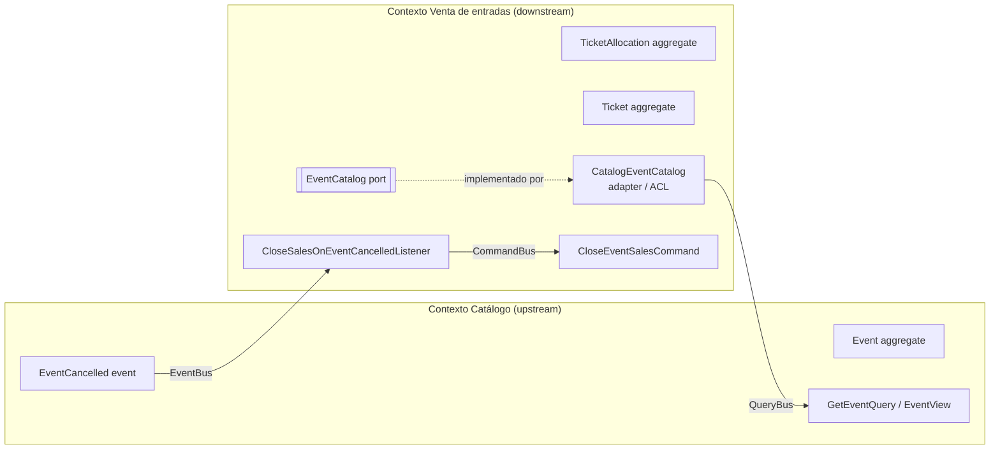

# Contextos acotados

## Mapa de contextos

Relación: **Customer/Supplier** con **Anti-Corruption Layer** en el lado de la venta.

## Por qué son dos contextos

| Aspecto | Catálogo | Venta de entradas |
|---|---|---|
| Pregunta que responde | ¿Qué eventos hay, dónde, cuándo y a qué precio? | ¿Quién tiene entrada, cuántas quedan, quién ya entró? |
| Lenguaje | evento, recinto, fecha, aforo, cartelera | cupo, entrada, titular, código, check-in, reembolso |
| Quién lo usa | La productora (organización) | El público y el personal de la puerta |
| Carga | Pocas escrituras | Picos de miles de compras simultáneas |
| Reglas | Recinto libre a esa hora, solo a futuro | No sobrevender, uso único, reembolso |
| Datos sensibles | No | Sí (código de entrada, email del titular) |

Para la venta, un evento es solo "algo con aforo, fecha de inicio, precio y que puede o
no venderse" (`SaleableEvent`). No necesita el nombre, el recinto ni la cartelera.
Mezclarlos acoplaría la carga de compras al mantenimiento del catálogo.

## Reglas de aislamiento (verificadas por `test/architecture`)

- `ticketing/domain` **no importa** nada de `catalog/` (ni entidades, ni value objects, ni errores).
- No se comparten value objects: `EventId` (catálogo) y `EventReference` (venta) son clases
  distintas; `TicketPrice` (catálogo) y `Money` (venta) también.
- `application/` de un contexto no importa otro contexto.
- La comunicación ocurre solo en `infrastructure/`:
  - **Consulta síncrona**: `CatalogEventCatalog` (adaptador del puerto propio `EventCatalog`)
    usa la API pública de lectura del catálogo (`GetEventQuery` por `QueryBus`) y traduce
    `EventView → SaleableEvent`. Un `EVENT_NOT_FOUND` se traduce a `null`.
  - **Evento asíncrono**: `CloseSalesOnEventCancelledListener` escucha `EventCancelled` y
    despacha el comando propio `CloseEventSalesCommand`.

## Casos de uso por contexto

| Contexto | Escritura (Command) | Lectura (Query) |
|---|---|---|
| Catálogo | `ScheduleEvent`, `CancelEvent` | `GetEvent`, `ListEvents` |
| Venta | `PurchaseTickets`, `CheckInTicket`, `CloseEventSales` (interno, disparado por evento) | `GetTicket`, `GetEventAvailability` |

## Integridad en base de datos

Ambos contextos comparten una instancia de PostgreSQL (monolito modular). Las FKs
`ticket_allocations.event_id` y `tickets.event_id → events.id` existen **solo en la
migración** como red de seguridad; en el código no hay relaciones ORM entre contextos. Si
en el futuro se separan físicamente, se eliminan las FKs y la garantía queda en el ACL (ADR-007).
