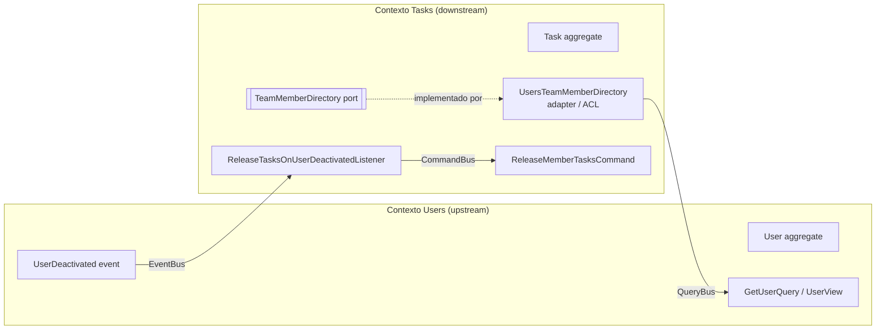

# Contextos acotados

## Mapa de contextos

Relación: **Customer/Supplier** con **Anti-Corruption Layer** en el lado de Tasks.

## Por qué son dos contextos

| Aspecto | Users | Tasks |
|---|---|---|
| Pregunta que responde | ¿Quién forma parte del equipo y puede trabajar? | ¿Qué trabajo hay y en qué estado está? |
| Lenguaje | usuario, email, contraseña, activo/inactivo | tarea, columna, responsable, prioridad, transición |
| Ciclo de vida | Cambia poco (alta, baja) | Cambia constantemente (movimientos en el tablero) |
| Reglas | Unicidad de email, política de contraseña | Flujo Kanban, responsable obligatorio, inmutabilidad de DONE |
| Datos sensibles | Sí (hash de contraseña) | No |

En Tasks un miembro es solo un **responsable** (`AssigneeId`) que puede o no
recibir trabajo (`TeamMember.isActive()`); no le interesan su email ni su
contraseña. Modelarlo con la entidad `User` acoplaría el tablero a la gestión de
identidad y expondría datos sensibles donde no hacen falta.

## Reglas de aislamiento (verificadas por `test/architecture`)

- `tasks/domain` **no importa** nada de `users/` (ni entidades, ni value objects, ni errores).
- No se comparten value objects: `UserId` (Users) y `AssigneeId` (Tasks) son clases
  distintas que solo comparten el **valor** del identificador.
- `application/` de un contexto no importa otro contexto.
- La comunicación ocurre solo en `infrastructure/`:
  - **Consulta síncrona**: `UsersTeamMemberDirectory` (adaptador del puerto propio
    `TeamMemberDirectory`) usa la API pública de lectura de Users
    (`GetUserQuery` por `QueryBus`) y traduce `UserView → TeamMember`. Un
    `USER_NOT_FOUND` se traduce a `null` (el adaptador no decide el error de negocio).
  - **Evento asíncrono**: `ReleaseTasksOnUserDeactivatedListener` escucha
    `UserDeactivated` (contrato publicado por Users) y despacha el comando propio
    `ReleaseMemberTasksCommand`.

## Casos de uso por contexto

| Contexto | Escritura (Command) | Lectura (Query) |
|---|---|---|
| Users | `CreateUser`, `DeactivateUser` | `GetUser` |
| Tasks | `CreateTask`, `AssignTask`, `ChangeTaskStatus`, `ReleaseMemberTasks` (interno, disparado por evento) | `GetTask`, `ListTasks` |

## Integridad en base de datos

Ambos contextos comparten una única instancia de PostgreSQL (monolito modular).
La FK `tasks.assignee_id → users.id` existe **solo en la migración**, como red de
seguridad de RN-011; en el código no hay relación ORM entre `TaskOrmEntity` y
`UserOrmEntity`. Si en el futuro los contextos se separan físicamente, se elimina la
FK y la garantía queda en el ACL (ver ADR-007).
