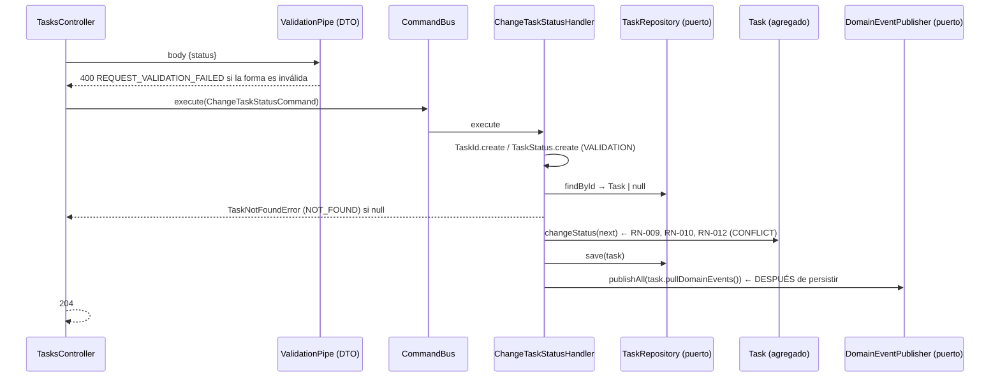

# Arquitectura: visión general

## Estilo

Arquitectura **hexagonal** (puertos y adaptadores) organizada **por contexto acotado**,
con **DDD táctico** dentro de cada contexto y **CQRS** en la capa de aplicación.

```
src/<contexto>/
├── domain/          Modelo de negocio. TypeScript puro.
│   ├── entities/        Agregados (User, Task) con comportamiento e invariantes
│   ├── value-objects/   Constructor privado + factory estática + equals()
│   ├── events/          Hechos ocurridos (nombre en pasado), clases planas
│   ├── errors/          Subclases de DomainException con código estable
│   └── ports/           Interfaces + token Symbol (repositorios, hasher, directorio)
├── application/     Casos de uso. Depende SOLO de domain/ (puertos).
│   ├── commands/<caso>/  *.command.ts + *.handler.ts  (escritura)
│   ├── queries/<caso>/   *.query.ts + *.handler.ts    (lectura)
│   └── views/            Modelos de lectura (sin datos sensibles)
└── infrastructure/  Adaptadores. Implementan los puertos o los invocan.
    ├── http/             Controladores + DTOs (adaptador de entrada)
    ├── persistence/
    │   ├── typeorm/      *.orm-entity.ts + *.mapper.ts + typeorm-*.repository.ts
    │   └── in-memory/    in-memory-*.repository.ts (pruebas)
    └── ...               security/, adapters/ (ACL), event-handlers/ (oyentes externos)
```

`src/shared/` es el *shared kernel*: solo contiene abstracciones genéricas
(`DomainException`, `AggregateRoot`, `DomainEvent`, puerto `DomainEventPublisher`,
utilidades de UUID) y piezas de infraestructura transversales (filtro HTTP,
`ValidationPipe`, publicador de eventos). **No** contiene value objects de negocio.

## Regla de dependencias

```
infrastructure ──► application ──► domain
       └────────────────────────────►┘
```

| Capa | Puede importar | No puede importar |
|---|---|---|
| `domain/` | `shared/domain`, su propio `domain/` | `@nestjs/*`, `typeorm`, `class-validator`, `application/`, `infrastructure/`, el dominio de otro contexto |
| `application/` | su `domain/`, `shared/domain`, `@nestjs/cqrs`/`@nestjs/common` (decoradores) | `infrastructure/`, repositorios concretos, otro contexto |
| `infrastructure/` | todo lo anterior, frameworks, la API pública de otro contexto (query/evento) | — |

La regla se **verifica automáticamente** en `test/architecture/architecture.spec.ts`
(parte de `pnpm test`).

## Flujo de un comando (ejemplo: `PATCH /tasks/:id/status`)



## CQRS

- Cada caso de uso tiene **su propia carpeta** con el comando/consulta y su handler.
- Los controladores solo crean el mensaje y llaman a `CommandBus.execute` /
  `QueryBus.execute`. No acceden a repositorios, no llaman handlers directamente,
  no contienen reglas.
- Los **comandos** devuelven como mucho el id creado (`{ id }`) o nada (`204`).
- Las **consultas** devuelven *views* (`UserView`, `TaskView`) construidas campo a campo.
- Los handlers **orquestan**: validan entradas vía value objects, cargan, delegan la
  decisión al agregado, persisten y publican. Las reglas viven en el dominio.

## Errores

- `DomainException` (abstracta) con `code` (estable, contrato con clientes) y
  `kind` (`VALIDATION | NOT_FOUND | CONFLICT`). El dominio no conoce HTTP.
- `DomainExceptionFilter` (único) traduce `kind → 400 | 404 | 409` con un
  `switch` exhaustivo (TypeScript falla si se añade un `kind` sin mapear).
- Un error de negocio nunca produce 500.
- Catálogo: [`../business-rules/error-catalog.md`](../business-rules/error-catalog.md).

## Validación en dos niveles

1. **Borde HTTP**: DTOs con `class-validator` + `ValidationPipe`
   (`whitelist: true`, `forbidNonWhitelisted: true`, `transform: true`). Valida forma,
   tipos y tamaños máximos. Responde `400 REQUEST_VALIDATION_FAILED` sin devolver los
   valores recibidos.
2. **Dominio**: value objects (formato, normalización, rangos) e invariantes de las
   entidades (transiciones, responsable obligatorio, inmutabilidad). El DTO **no**
   reemplaza esta validación: los handlers y `fromPrimitives()` la aplican siempre.

Ejemplo: `password: "onlyletters"` pasa el DTO (es un string) pero el dominio lo
rechaza con `USER_WEAK_PASSWORD` (RN-004).
