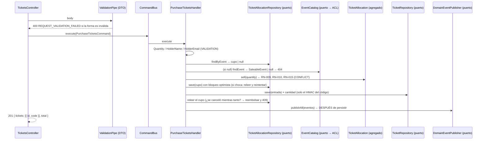

# Arquitectura: visión general

## Estilo

Arquitectura **hexagonal** (puertos y adaptadores) organizada **por contexto acotado**,
con **DDD táctico** dentro de cada contexto y **CQRS** en la capa de aplicación.

```
src/<contexto>/
├── domain/          Modelo de negocio. TypeScript puro.
│   ├── entities/        Agregados (Event, TicketAllocation, Ticket) con comportamiento e invariantes
│   ├── value-objects/   Constructor privado + factory estática + equals()
│   ├── events/          Hechos ocurridos (nombre en pasado), clases planas
│   ├── errors/          Subclases de DomainException con código estable
│   └── ports/           Interfaces + token Symbol (repositorios, catálogo, hasher)
├── application/     Casos de uso. Depende SOLO de domain/ (puertos).
│   ├── commands/<caso>/  *.command.ts + *.handler.ts  (escritura)
│   ├── queries/<caso>/   *.query.ts + *.handler.ts    (lectura)
│   └── views/            Modelos de lectura (sin datos secretos)
└── infrastructure/  Adaptadores. Implementan los puertos o los invocan.
    ├── http/             Controladores + DTOs (adaptador de entrada)
    ├── persistence/
    │   ├── typeorm/      *.orm-entity.ts + *.mapper.ts + typeorm-*.repository.ts
    │   └── in-memory/    in-memory-*.repository.ts (pruebas)
    └── ...               security/ (HMAC), adapters/ (ACL), event-handlers/ (oyentes externos)
```

`src/shared/` es el *shared kernel*: solo abstracciones genéricas (`DomainException`,
`AggregateRoot` con versión, `DomainEvent`, puerto `DomainEventPublisher`, utilidades de
UUID/azar) y piezas de infraestructura transversales (filtros HTTP, `ValidationPipe`,
publicador de eventos). **No** contiene value objects de negocio.

## Regla de dependencias

```
infrastructure ──► application ──► domain
```

| Capa | Puede importar | No puede importar |
|---|---|---|
| `domain/` | `shared/domain`, su propio `domain/` | `@nestjs/*`, `typeorm`, `class-validator`, `application/`, `infrastructure/`, otro contexto |
| `application/` | su `domain/`, `shared/domain`, `@nestjs/cqrs`/`@nestjs/common` (decoradores) | `infrastructure/`, repositorios concretos, otro contexto |
| `infrastructure/` | todo lo anterior, frameworks, la API pública de otro contexto (query/evento) | — |

Se **verifica automáticamente** en `test/architecture/architecture.spec.ts` (`pnpm test`).

## Flujo de un comando (ejemplo: `POST /tickets`, comprar entradas)



## CQRS

- Cada caso de uso tiene **su propia carpeta** con el comando/consulta y su handler.
- Los controladores solo construyen el mensaje y llaman a `CommandBus.execute` /
  `QueryBus.execute`. No acceden a repositorios, no llaman handlers, no contienen reglas.
- Los **comandos** devuelven lo mínimo (`{ id }`, o los códigos de entrada, que solo
  pueden entregarse en ese momento).
- Las **consultas** devuelven *views* construidas campo a campo.
- Los handlers **orquestan**: validan con value objects, cargan, delegan la decisión al
  agregado, persisten y publican. Las reglas viven en el dominio.

## Errores

- `DomainException` con `code` (estable) y `kind` (`VALIDATION | NOT_FOUND | CONFLICT`).
- `DomainExceptionFilter` (único) traduce a 400/404/409 con un `switch` exhaustivo.
- `HttpExceptionFilter` solo da la misma forma a los errores del framework (JSON mal formado, ruta inexistente).
- Un error de negocio nunca produce 500. Catálogo: [`../business-rules/error-catalog.md`](../business-rules/error-catalog.md).

## Validación en dos niveles

1. **Borde HTTP**: DTOs + `ValidationPipe` (`whitelist`, `forbidNonWhitelisted`, `transform`):
   forma, tipos y tamaños máximos. Ejemplo: `quantity: "2"` (texto) → 400.
2. **Dominio**: value objects e invariantes. Ejemplo: `quantity: 11` pasa el DTO (es un
   entero) pero el dominio responde `TICKET_INVALID_QUANTITY` (RN-008).

## Concurrencia

Todos los agregados llevan `version` (ADR-011): un guardado solo se aplica si nadie
modificó el agregado desde que se leyó. La compra reintenta con espera aleatoria cuando
otra compra cambió el cupo (ADR-012), y las operaciones disparadas por eventos
(`CloseEventSales`) releen y reintentan porque no pueden devolver un 409 a nadie.
