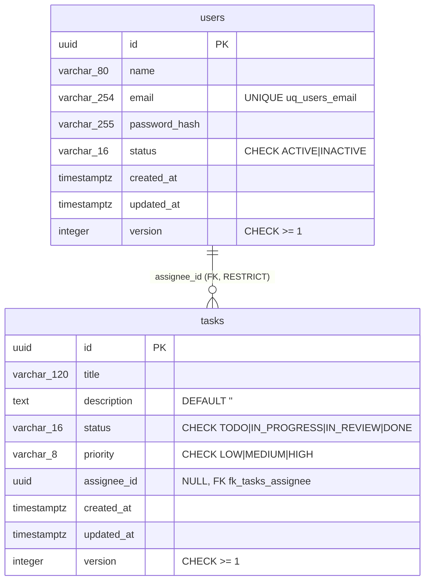

# Persistencia y migraciones

## Principios

- **PostgreSQL 16** (Docker Compose) + **TypeORM 0.3**.
- `synchronize: false` en **todos** los entornos (`src/config/database.config.ts`).
  El esquema sale exclusivamente de migraciones versionadas con `up()` y `down()`.
- **Una sola definición de conexión** (`buildDataSourceOptions`) usada por la app
  (`TypeOrmModule.forRootAsync`) y por el CLI (`src/config/typeorm.data-source.ts`),
  ambas alimentadas por la misma validación de entorno.
- Entidades y migraciones se registran en **listas explícitas**
  (`src/database/orm-entities.ts`, `src/database/migrations/index.ts`): funcionan igual
  con `ts-node`, con Jest y con `dist/`, sin globs frágiles.
- `logging: false`: los parámetros de las consultas (hashes) nunca llegan al log.
- Las entidades ORM (`*.orm-entity.ts`) son clases **distintas** de las entidades de
  dominio; los **mappers** traducen en ambos sentidos y reconstruyen con
  `fromPrimitives()` (que revalida).

## Modelo de datos

## Restricciones e índices

| Objeto | Tipo | Regla que respalda | Por qué en la base |
|---|---|---|---|
| `pk_users`, `pk_tasks` | PRIMARY KEY | Identidad | — |
| `uq_users_email` | UNIQUE | RN-002 | Dos registros concurrentes pueden pasar el chequeo del handler; solo la base lo garantiza. El adaptador traduce la violación `23505` a `USER_EMAIL_ALREADY_IN_USE` (409). Probado en e2e con 3 peticiones simultáneas. |
| `ck_users_status` | CHECK | Estados del dominio | Defensa en profundidad |
| `fk_tasks_assignee` | FOREIGN KEY `ON DELETE RESTRICT` | RN-011 | El responsable debe existir; los usuarios se desactivan, no se borran. Violación `23503` → `TASK_ASSIGNEE_NOT_FOUND`. |
| `ck_tasks_status`, `ck_tasks_priority` | CHECK | RN-009, RN-014 | Defensa en profundidad |
| `ck_tasks_assignee_required` | CHECK `status = 'TODO' OR assignee_id IS NOT NULL` | RN-010 | La invariante se mantiene aunque se escriba fuera de la app |
| `ix_tasks_status_created_at` | INDEX | Filtro por columna del tablero ordenado | Consulta `GET /tasks?status=` |
| `ck_users_version`, `ck_tasks_version` | CHECK `version >= 1` | Bloqueo optimista (ADR-011) | Defensa en profundidad |
| `ix_tasks_assignee_id` | INDEX | Filtro por responsable / liberación de tareas | `GET /tasks?assigneeId=`, RN-013 |

## Migraciones

| Archivo | up | down |
|---|---|---|
| `1759363200000-CreateUsersTable.ts` | `CREATE TABLE users` + PK, UNIQUE, CHECK | `DROP TABLE users` |
| `1759363260000-CreateTasksTable.ts` | `CREATE TABLE tasks` + PK, FK, CHECKs, 2 índices | `DROP INDEX` ×2, `DROP TABLE tasks` |
| `1759413600000-AddOptimisticLockingVersion.ts` | columna `version` + CHECK en ambas tablas | `DROP CONSTRAINT`, `DROP COLUMN` |

Evidencia de reversibilidad: `test/e2e/migrations.e2e-spec.ts` revierte las tres
migraciones, comprueba que la columna `version` y las tablas desaparecen y las vuelve a aplicar.

## Adaptadores de repositorio

| Puerto | Adaptador real | Adaptador en memoria |
|---|---|---|
| `UserRepository` | `TypeOrmUserRepository` | `InMemoryUserRepository` (emula el UNIQUE de email) |
| `TaskRepository` | `TypeOrmTaskRepository` | `InMemoryTaskRepository` |

Contrato común: `findById` devuelve `null` si no existe (no lanza); los adaptadores
solo consultan, guardan y traducen; los listados se ordenan por `created_at, id`.

## Bloqueo optimista (ADR-011)

- Un agregado nuevo tiene `version = 0` y se **inserta** con `version = 1`.
- Uno existente se guarda con `UPDATE … SET …, version = version + 1 WHERE id = ? AND version = ?`.
  Si no se actualiza ninguna fila, otra operación lo modificó después de leerlo y el
  adaptador lanza `*_CONCURRENT_MODIFICATION` (409) en lugar de sobrescribir.
- Tras guardar, el adaptador llama a `markAsPersisted()` (la instancia queda en la versión nueva).
- El adaptador en memoria emula exactamente el mismo contrato.
- Evidencia: `test/e2e/concurrency.e2e-spec.ts` (adaptador real) y los specs en memoria;
  se comprobó que la prueba e2e falla si se restaura el `save()` anterior.
