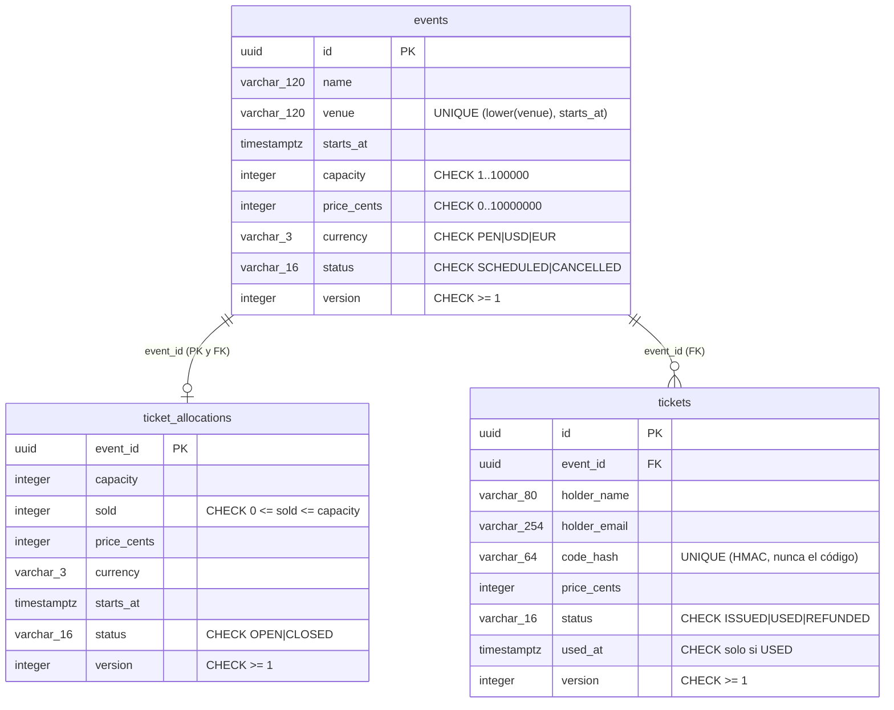

# Persistencia y migraciones

## Principios

- **PostgreSQL 16** (Docker Compose) + **TypeORM 0.3**.
- `synchronize: false` en **todos** los entornos. El esquema sale solo de migraciones con `up()` y `down()`.
- **Una sola definición de conexión** (`buildDataSourceOptions`) para la app y el CLI.
- Entidades y migraciones en **listas explícitas** (`src/database/`): funcionan igual con ts-node, Jest y `dist/`.
- `logging: false`: los parámetros de las consultas (hashes, emails) nunca llegan al log.
- Las entidades ORM (`*.orm-entity.ts`) son clases **distintas** de las de dominio; los
  **mappers** traducen y reconstruyen con `fromPrimitives()` (que revalida).

## Modelo de datos

(`created_at`/`updated_at`/`purchased_at` omitidos en el diagrama.)

## Restricciones e índices

| Objeto | Tipo | Regla | Por qué en la base |
|---|---|---|---|
| `uq_events_venue_starts_at` | UNIQUE INDEX `(lower(venue), starts_at)` | RN-006 | Dos programaciones simultáneas pasan ambas el chequeo del handler; solo la base lo garantiza. Violación `23505` → `EVENT_SLOT_TAKEN`. Probado en e2e con 3 peticiones simultáneas. |
| `ck_events_capacity`, `ck_events_price`, `ck_events_currency`, `ck_events_status` | CHECK | RN-004, RN-005 | Defensa en profundidad |
| `pk_ticket_allocations` | PRIMARY KEY `(event_id)` | RN-009 | Un único cupo por evento: si dos primeras compras lo crean a la vez, una recibe `23505` → se traduce a conflicto y se reintenta. |
| `ck_ticket_allocations_sold` | CHECK `sold BETWEEN 0 AND capacity` | RN-009 | Última barrera contra la sobreventa aunque falle el código. |
| `fk_ticket_allocations_event`, `fk_tickets_event` | FOREIGN KEY `ON DELETE RESTRICT` | — | La venta solo existe para eventos del catálogo; los eventos se cancelan, no se borran. |
| `uq_tickets_code_hash` | UNIQUE | RN-012 | Cada código (su HMAC) identifica una sola entrada. |
| `ck_tickets_used_at` | CHECK `(status = 'USED') = (used_at IS NOT NULL)` | RN-013 | Estado y fecha de uso siempre coherentes. |
| `ck_*_version` | CHECK `version >= 1` | ADR-011 | Bloqueo optimista |
| `ix_events_status_starts_at`, `ix_tickets_event_status` | INDEX | Consultas | Cartelera por estado/fecha; reembolso de las entradas de un evento. |

## Migraciones

| Archivo | up | down |
|---|---|---|
| `1759536000000-CreateEventsTable.ts` | `events` + PK, CHECKs, índice único funcional, índice | `DROP INDEX` ×2, `DROP TABLE` |
| `1759536060000-CreateTicketingTables.ts` | `ticket_allocations` + `tickets` con PK, FKs, UNIQUE, CHECKs, índice | `DROP INDEX`, `DROP TABLE` ×2 |

Evidencia de reversibilidad: `test/e2e/migrations.e2e-spec.ts` revierte ambas, comprueba
que las tablas desaparecen y las vuelve a aplicar.

## Adaptadores de repositorio

| Puerto | Adaptador real | Adaptador en memoria |
|---|---|---|
| `EventRepository` | `TypeOrmEventRepository` | `InMemoryEventRepository` (emula el índice único) |
| `TicketAllocationRepository` | `TypeOrmTicketAllocationRepository` | `InMemoryTicketAllocationRepository` (emula la PK) |
| `TicketRepository` | `TypeOrmTicketRepository` | `InMemoryTicketRepository` |

Contrato común: las búsquedas devuelven `null` si no hay resultado; los adaptadores solo
consultan, guardan y traducen; todos aplican bloqueo optimista.

## Bloqueo optimista (ADR-011)

- Agregado nuevo: `version = 0` → se **inserta** con `version = 1`.
- Existente: `UPDATE … SET …, version = version + 1 WHERE id = ? AND version = ?`. Si no se
  actualiza ninguna fila, otra operación lo cambió: `*_CONCURRENT_MODIFICATION` en lugar de sobrescribir.
- Evidencia: `test/e2e/concurrency.e2e-spec.ts`. **Sin** el bloqueo, 30 compradores
  simultáneos para 5 plazas obtienen 16 entradas (comprobado); **con** él, exactamente 5.
